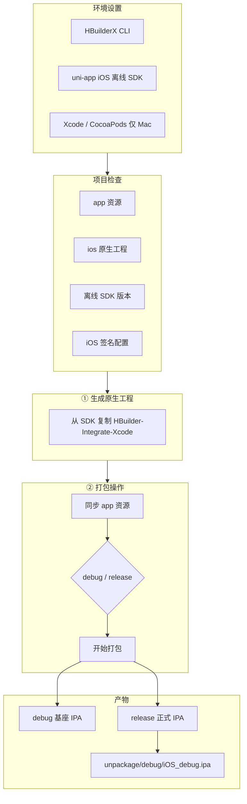

# iOS 基座与正式包 — 后续完善规划

> 文档版本：v0.1  
> 关联项目：`uni-app 打包助手`（uTools）  
> Android 现状见：[uniapp-pack-mvp.md](./uniapp-pack-mvp.md)

---

## 1. 目标

在现有 **Android 离线打包 + 云打包** 能力基础上，补齐与参考插件「uniapp应用开发工具」对等的 **iOS 流程**：

| 能力 | 说明 |
|------|------|
| **iOS 基座包（debug）** | 自定义调试基座，供 HBuilderX「使用自定义基座运行」 |
| **iOS 正式包（release）** | 可分发 / TestFlight / App Store 的 IPA |
| **云打包 iOS** | 走 DCloud 云端（Windows 可用） |
| **离线打包 iOS** | 本地 SDK + Xcode 工程（**需 macOS**） |

第一版 Android 已验证的路径：`编译 app 资源 → 生成原生工程 → 同步 www → 打包`。

iOS 沿用同一骨架，替换工具链（Xcode / CocoaPods / 证书体系）。

---

## 2. 平台差异（必读）

| 项 | Android（已实现） | iOS（待做） |
|----|-------------------|-------------|
| 离线 SDK 模板 | `HBuilder-Integrate-AS` | `HBuilder-Integrate-Xcode`（SDK 包内） |
| 原生工程目录 | `项目/native/android` | `项目/native/ios`（建议） |
| 调试产物 | `apk/debug` | `.ipa`（debug 基座） |
| 正式产物 | `apk/release` | `.ipa`（release） |
| 本地编译环境 | Windows + JDK + Android SDK | **macOS + Xcode + CocoaPods** |
| 签名 | keystore + alias | 证书 `.p12` + 描述文件 `.mobileprovision` |
| 插件在 Windows 上 | 可完整离线打包 | **仅云打包 / 资源编译**；离线 IPA 需 Mac 或远程 Mac |

**结论：** 插件在 Windows 上可先做完 **iOS 云打包 + 资源同步 + 配置管理**；**离线基座 / 正式 IPA** 的 Xcode 构建步骤需在 Mac 执行（插件可生成工程与脚本，或调用 SSH/CI）。

---

## 3. 与 Android 流程对齐（目标形态）



### 3.1 用户操作顺序（与 Android 一致）

1. **环境设置**：HBuilderX CLI、Node（可选）、**iOS 离线 SDK 路径**；Mac 上另配 Xcode 路径  
2. **项目配置**：Bundle ID、**iOS AppKey**（`manifest` → `sdkConfigs.dcloud.appkey`）、证书说明  
3. **项目检查**：app 资源 / ios 工程 / SDK 版本 / 签名是否就绪  
4. **生成 iOS 源码工程** → `native/ios`  
5. **打包操作**：选平台 **ios** → debug(基座) / release(正式) → **同步 app 资源** → **开始打包**  
6. **安装为 HX 本地基座**（仅 debug）：复制到 `unpackage/debug/iOS_debug.ipa`

---

## 4. 环境配置规划（环境设置页扩展）

| 配置项 | 用途 | 必填 | 备注 |
|--------|------|------|------|
| HBuilderX CLI | 编译资源 / 云打包 | ✅ | 已有 |
| Node | CLI 型项目 | 可选 | 已有 |
| **uni-app 离线 SDK（iOS）** | 含 `HBuilder-Integrate-Xcode` | 离线必填 | 与 Android SDK 同版本号（如 4.87） |
| **Xcode 路径** | `xcodebuild` | Mac 离线必填 | `xcode-select -p` 或 `Xcode.app` |
| **CocoaPods** | 依赖安装 | Mac 离线建议 | `pod` 是否在 PATH |
| **Apple 开发者账号** | 签名 | 正式包必填 | 插件仅存 p12 + profile 路径，不存账号密码 |

Android 已有项（Java / Android SDK）在 iOS 流程中不冲突，保留。

---

## 5. 项目配置规划（项目配置页扩展）

| 配置项 | manifest / 原生对应 | 说明 |
|--------|---------------------|------|
| **Bundle ID** | `app-plus.distribute.ios.bundleid` | 与开发者中心一致 |
| **iOS AppKey** | `sdkConfigs.dcloud.appkey` | 控制台「配置信息」→ iOS 行；**自动 trim**（同 Android） |
| **证书类型（云打包）** | `pack` json | 开发 / 发布 / 企业等，对齐 HBuilderX 云打包 |
| **iOS 离线签名（Mac）** | Xcode Signing | 见下节 |

### 5.1 iOS 签名（待产品设计）

**云打包（Windows 可用）：**

- 私钥证书 `.p12` + 密码  
- Profile `.mobileprovision`  
- 可选：证书别名、Bundle ID 自动校验  

**离线 Xcode 打包（Mac）：**

- 可在 `native/ios` 工程写入 `Signing & Capabilities`  
- 或使用 `xcodebuild -exportArchive` + `ExportOptions.plist`

插件 UI 建议分区：**云打包证书** / **离线 Xcode 签名（仅 Mac）**，避免与 Android keystore 混在同一表单。

---

## 6. 打包操作 UI 规划

参考 Android「打包操作」卡片，扩展为双平台或 Tab：

```
选择平台：  ☑ android   ☐ ios

选择模式：  ○ debug(基座包)   ○ release(正式包)

ios 渠道包：（若云打包需要，二期）

android: [查看签名] [卸载&安装] | [同步app资源] [开始打包]
```

**ios 专用按钮（建议）：**

| 按钮 | 行为 |
|------|------|
| 同步 app 资源 | 同 Android，`cli publish --type appResource`（平台含 iOS） |
| 生成 iOS 工程 | 从离线 SDK 复制模板到 `native/ios` |
| 开始打包 | debug：`xcodebuild` 打模拟器/真机调试包；release：Archive + Export IPA |
| 安装为 HX 本地基座 | 复制 IPA → `unpackage/debug/iOS_debug.ipa` |
| 打开 IPA 目录 | 打开 `build/export` 或 `unpackage/release` |

---

## 7. 技术实现拆分（开发任务）

### Phase A — 基础（Windows 可做）

- [ ] `plugin.json` / UI：平台增加 **ios** 勾选  
- [ ] 环境设置：`uniappOfflineSdkPath` 校验含 iOS 模板目录  
- [ ] 项目配置：Bundle ID、iOS AppKey 读写 `manifest.json`  
- [ ] **云打包 iOS**：扩展 `buildPackConfig` + `cli pack --platform ios`（证书 json）  
- [ ] 编译 app 资源：确认 `publish` 对 iOS 资源输出路径（`unpackage/resources/__UNI__xxx/www` 通常共用）  
- [ ] 项目检查：`ios` 项（资源 / 云打包证书是否填写）  
- [ ] 文档：说明 Windows 仅能云打包 iOS，离线需 Mac  

**产出：** 云 IPA、资源同步、配置管理闭环。

### Phase B — 离线工程（需 Mac 验证）

- [ ] 新建 `preload/offline-ios.js`（对标 `offline-android.js`）  
  - `findIosTemplate(sdkRoot)` → `HBuilder-Integrate-Xcode`  
  - `generateIosProject(project, env)` → `native/ios`  
  - `syncWwwToIos(project)` → 拷贝到 Xcode 工程约定目录  
  - `patchInfoPlist / dcloud 配置`：appid、appkey、Bundle ID  
- [ ] `inspectIosProject()` 供项目检查面板  
- [ ] 生成后写入 `ios/Podfile`，打包前执行 `pod install`（可选开关）  

**产出：** Mac 上可打开工程、资源正确。

### Phase C — debug 基座 IPA

- [ ] `xcodebuild` debug 配置（Development 签名）  
- [ ] 导出 debug IPA 路径规范：`native/ios/build/debug/*.ipa`  
- [ ] **安装为 HX 本地基座**：复制为 `unpackage/debug/iOS_debug.ipa`（DCloud 约定文件名）  
- [ ] 日志：GBK/UTF-8 与 Android 一致  

**产出：** HBuilderX 可选「本地基座」调试 iOS。

### Phase D — release 正式包

- [ ] `validateIosReleaseSigning()`：p12、profile、密码  
- [ ] Archive + `exportArchive` → release IPA  
- [ ] 副本：`unpackage/release/iOS_release.ipa`（对标 `android_release.apk`）  
- [ ] AppKey / Bundle ID 打包前强制同步（复用 Android `validateAppkey` 逻辑，区分 iOS key）  

**产出：** 可上传 TestFlight 的 IPA（仍需苹果侧流程）。

### Phase E — 体验与参考插件对齐

- [ ] 配置信息卡片：展示 AppID、iOS AppKey（只读复制，对齐控制台截图）  
- [ ] 「查看 ios 签名」弹窗  
- [ ] 卸载 & 安装：Mac 上 `ios-deploy` / `ideviceinstaller`（可选，依赖本机工具）  
- [ ] logo / 文档更新 README  

---

## 8. 关键路径约定（建议）

| 用途 | 路径 |
|------|------|
| iOS 原生工程 | `{项目}/native/ios/` |
| app 资源 | `{项目}/unpackage/resources/__UNI__{appid}/www` |
| HX debug 基座 | `{项目}/unpackage/debug/iOS_debug.ipa` |
| release 副本 | `{项目}/unpackage/release/iOS_release.ipa` |
| 离线 SDK | `{Android-SDK@version}/` 同包内 iOS 目录 |

（具体以 DCloud 当版离线 SDK 文档为准，开发时以 SDK 包内实际目录名为准。）

---

## 9. HBuilderX / CLI 参考

| 操作 | Android（现状） | iOS（待接入） |
|------|-----------------|---------------|
| 编译 app 资源 | `cli publish --type appResource` | 同上，资源通常共用 |
| 云打包 | `cli pack --platform android --config xxx.json` | `cli pack --platform ios --config xxx.json` |
| 自定义基座 | `unpackage/debug/android_debug.apk` | `unpackage/debug/iOS_debug.ipa` |
| 离线打包 | 本地 SDK + Gradle | 本地 SDK + Xcode |

官方文档（开发时查阅）：

- [uni-app 离线打包](https://nativesupport.dcloud.net.cn/AppDocs/README)
- [HBuilderX CLI 打包](https://hx.dcloud.net.cn/cli/pack)
- [自定义调试基座说明](https://ask.dcloud.net.cn/article/35115)

---

## 10. 风险与约束

1. **必须在 Mac 上验证** Xcode 工程模板、签名、IPA 导出，Windows 插件无法端到端自测离线 iOS。  
2. **SDK 版本** 必须与 HBuilderX 一致（如 4.87），否则基座与资源不兼容。  
3. **AppKey** 区分 Android / iOS 行；控制台分别配置，插件需支持分平台展示与写入。  
4. **企业证书 / 推送 / 第三方 SDK** 可能需改 `Info.plist`、Capabilities，二期按项目迭代。  
5. 用户无 Mac 时，明确引导使用 **云打包 iOS**，避免「开始打包」误点离线。

---

## 11. 验收标准（完成后）

- [ ] Windows：可选 ios → 云打包成功，日志可见下载地址或产物路径  
- [ ] Mac：生成 `native/ios` → 同步资源 → debug IPA → 复制为 `iOS_debug.ipa` → HBuilderX 自定义基座运行  
- [ ] Mac：release IPA 导出，`iOS_release.ipa` 副本存在，安装到真机不报 appkey 错误  
- [ ] 项目检查四项状态正确；AppKey 无首尾空格  
- [ ] `issues/uniapp-pack-mvp.md` 增加 iOS 对照表链接  

---

## 12. 建议实施顺序

```
Phase A（云打包 + 配置）  →  1～2 周，Windows 可交付
        ↓
Phase B（离线工程生成）   →  需 Mac，1 周
        ↓
Phase C（debug 基座）     →  需 Mac，与 HBuilderX 联调
        ↓
Phase D（release 正式包） →  需 Mac + 有效证书
        ↓
Phase E（体验打磨）
```

---

## 13. 变更记录

| 日期 | 说明 |
|------|------|
| 2026-05-22 | 初稿：iOS 基座 + 正式包后续规划 |
